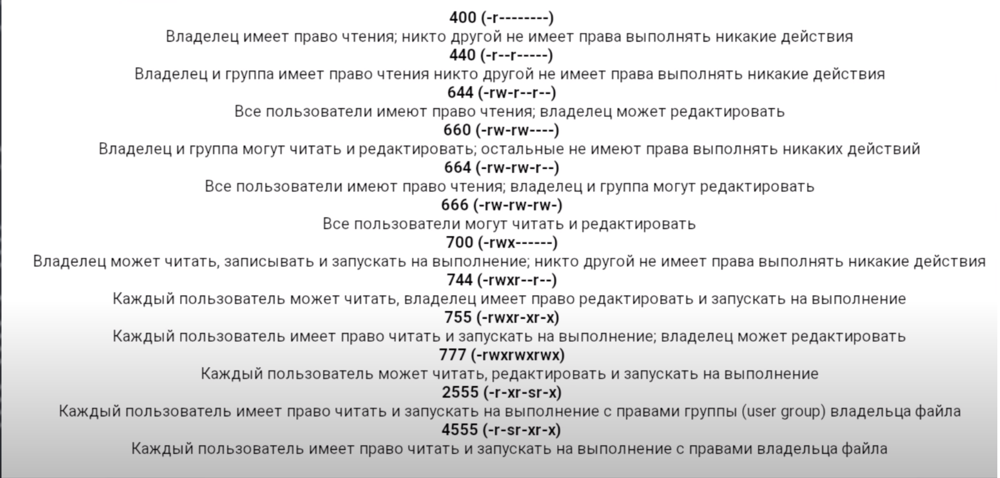

## gitHub format
 * [help]( https://docs.github.com/en/get-started/writing-on-github/getting-started-with-writing-and-formatting-on-github/basic-writing-and-formatting-syntax)

## Настраиваем firewall
```
Устанавливаем удобный брандмауэр UFW.
sudo apt install ufw

Если происходило переподключение, то система запросит пароль нового администратора.
Установим защиту от брутфорса паролей:
apt install -y fail2ban

Запрещаем все входящие подключения.
sudo ufw default deny incoming

Делаем исключение для удалённого управления.
sudo ufw allow ssh

Разрешаем все исходящие подключения.
sudo ufw default allow outgoing

Активируем брандмауэр.
sudo ufw enable

На запрос подтверждения вводим “y”.

Проверяем правильность настройки.
sudo ufw status verbose
https://ruvds.com/ru/helpcenter/telegram-bot-dlya-ruvds/

```
## create dir
 - mkdir dirname
 - mkdir dirname1 dirname2
 - mkdir [option] dieNameHere
 - mkdir -p dir1/dir2/dir3

## creat file
 - touch filename

## вывод dir в которой мы находимся
 - pwd

##  Права доступа
 - [help](https://www.linuxrsp.ru/artic/art2.html)
 - chmod   // Изменить
 - ls -la file-name // список прва доступа
 - ls -l file-name // список прва доступа

## Изменить Владельца
  - chown 
  - see documentation 

## установка и удаление программ
 1. пакетный менежер apt
  - sudo apt-get update //обновить всегда перед установкой
  - sudo apt-get install programm-name // установить
  - sudo apt remove programm-name // удалить
  - sudo apt purge programm-name  // удалить хвосты
 2. установка прогр с расширением name-pogramm-pak.deb
  - скачать файл у вендора name-pogramm-pak.deb
  - sudo dpkg --install name-pogramm-pak.deb // установить
  - sudo dpkg --remove name-pogramm-pak.deb
  - // dpkg debian-pakedg  name-pog + tab = full name in terminal

  